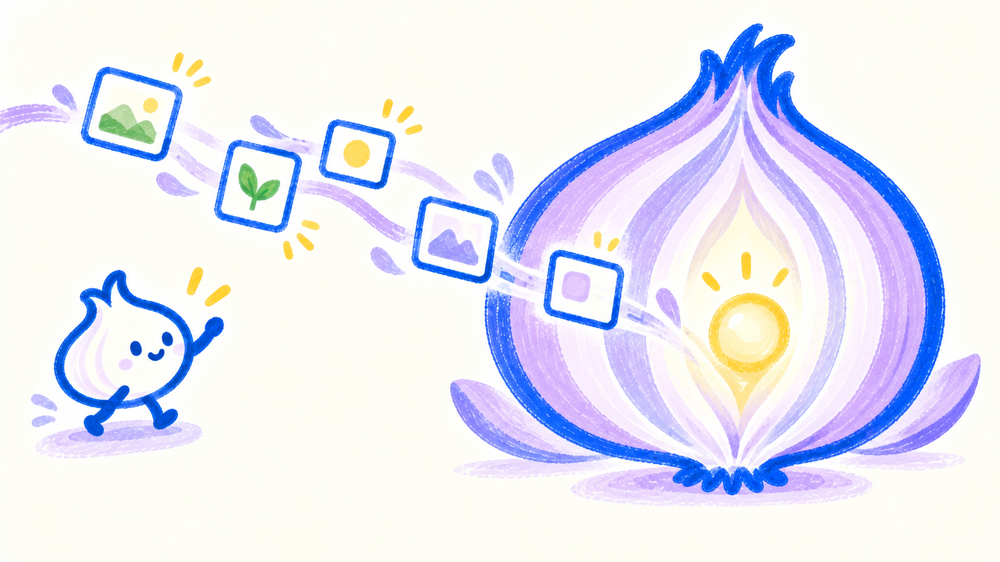
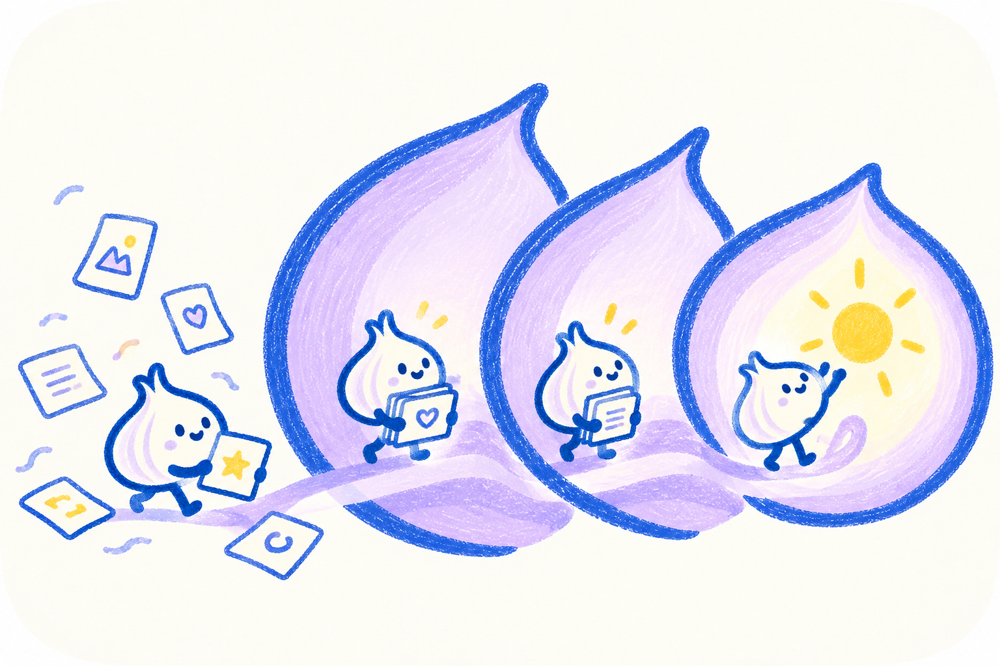
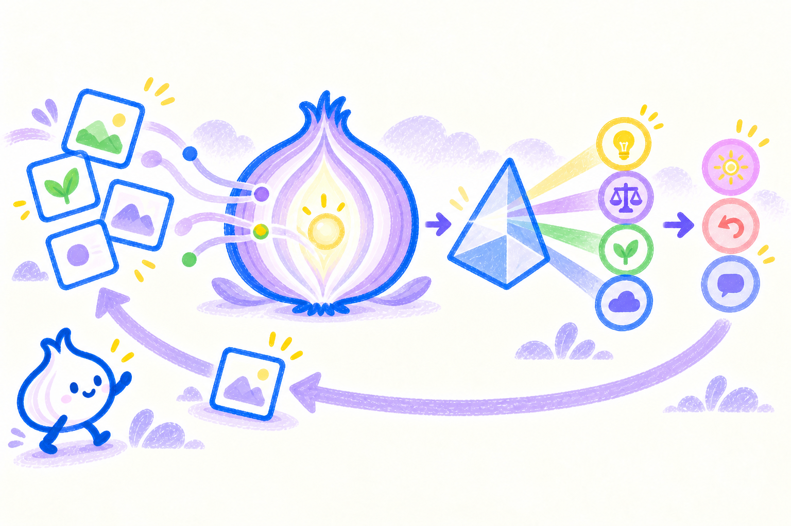
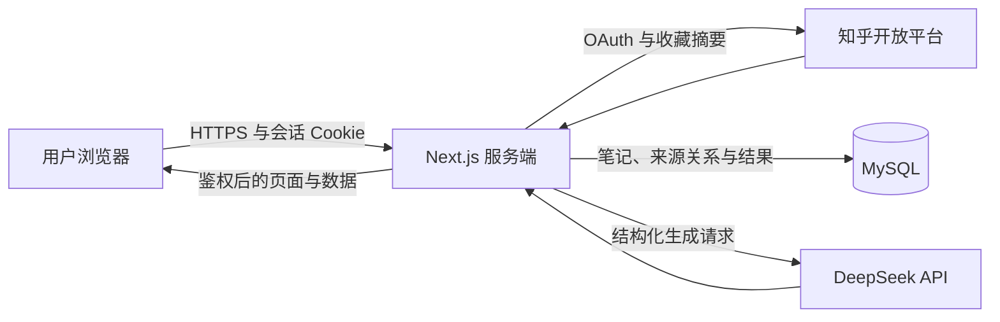
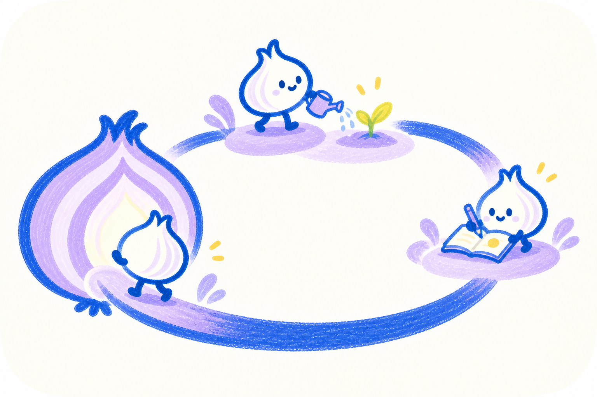
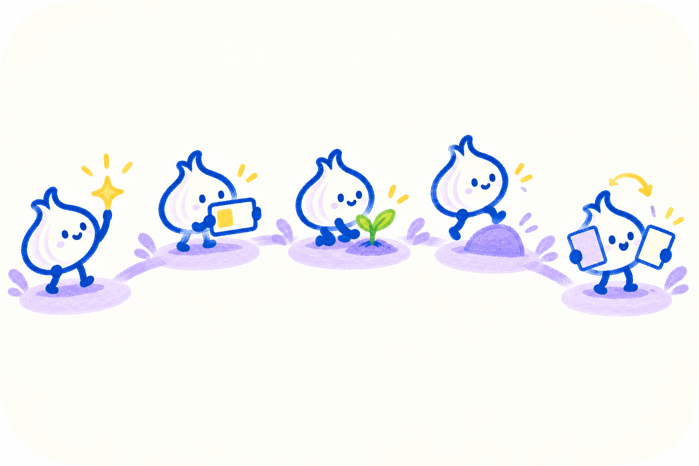

# OnionMind 产品计划书

> 知乎 AI Hackathon · 核心方案版  
> 当前状态：小范围真实内测  
> 文档基线：2026 年 9 月 15 日



*零散信息穿过洋葱的层次，逐渐形成清晰、可追溯的判断。*

## 一、灵感起源：收藏不是终点，理解之后还要走向行动

知乎帮助用户发现优质内容、比较不同观点，并把值得保留的回答和文章收入收藏。问题通常不在于缺少信息，而在于收藏之后：内容越积越多，真正被重新阅读、理解和用于判断的部分却很少。

当用户再次面对相似问题时，往往只剩下模糊印象：收藏过什么、依据是什么、在哪些条件下成立、是否存在反例，已经很难完整想起。即使形成了一个新判断，如果它没有进入现实行动，也无法知道这个判断是否适合自己。

OnionMind 的灵感，来自这两段尚未闭合的过程：一段是从收藏到理解，另一段是从判断到行动。它希望沿着知乎已有的阅读与收藏行为继续向后走，把用户主动记录的笔记和主动同步的知乎收藏摘要整理成可追溯的认知材料，再把材料中的下一步行动变成可以执行、记录和修正的小实验。

很多困惑之所以难以解释，并不是因为没有答案，而是事实、感受、个人判断和未经验证的推测混在了一起。普通 AI 倾向于快速给出一个完整解释，这种回答可能听起来很有道理，却不一定有足够依据，甚至会把模型的推测包装成事实。

因此，OnionMind 不急着替用户给出结论，而是从用户选择的材料出发，逐层澄清事实、梳理判断、提出假设、寻找证据与反证，并把仍待验证的部分交还给现实行动。“洋葱”由此成为产品的核心隐喻：每剥开一层，问题的结构就更清楚一些；每完成一次小实验，用户也多了一份能够带回下一轮思考的新材料。

## 二、核心思路：把“收藏过”变成“真正想过”

用户并不缺信息。

看到一篇好回答时，我们会顺手收藏；遇到一个值得记住的观点，也会先放进收藏夹。久而久之，收藏越来越多，真正回看和调用的内容却越来越少。需要表达观点、判断问题或作出选择时，我们往往只剩下模糊印象：它说了什么、依据是什么、在哪些条件下成立、是否存在反例，已经很难完整想起。

OnionMind 要解决的不是“怎样获得更多内容”，而是**怎样让已有信息从保存走向理解，再从理解走向可以验证和修正的行动**。

产品以用户主动记录的笔记和主动同步的知乎收藏摘要为材料，形成两层认知加工：

1. **记忆卡**：把一条收藏摘要整理为核心主张、关键依据、适用条件、反例或限制、延伸问题和关键词，并始终保留知乎原文入口。
2. **认知反馈**：把用户选择的笔记与记忆卡放在一起，区分有材料支持的观察和仍待验证的假设，同时给出其他解释、不确定性、关键问题和下一步行动。

因此，OnionMind 不是替用户总结一遍，也不是替用户宣布结论。它更像一面认知镜子：把一个判断的来路、支撑和缺口同时照出来，让用户自己决定是否接受、修正或挑战。认知反馈中的“下一步行动”还可以进入洋葱实验原型，被缩小为一次真实尝试；实验结果和新认识再回到下一轮思考，让判断不只停留在屏幕上。



*零散收藏不是被再次压缩，而是沿着可追溯的层次逐步变成能够理解和使用的认识。*

### 笔记的 AI 功能：从记录入口进入认知拆解

笔记不是附属的文字仓库，而是 OnionMind 中用户表达自身问题的入口。用户可以先写下一个尚未整理好的困惑、一次事件、一个判断或一段复盘，再主动选择一篇或多篇笔记进行 AI 分析，也可以把笔记与知乎收藏生成的记忆卡放在一起分析。

当前版本会把所选笔记正文作为认知反馈材料，并输出：有材料支持的观察、待验证假设及其弱/中/强支持度、其他可能解释、当前不确定性、下一层关键问题和一个可执行的小行动。照片只保存和展示，不发送给 AI。

这与普通的“总结笔记”不同：AI 的任务不是缩短文字，而是把用户表达拆成可检查的认知结构。构想文档提出的“每次只追问一个关键问题、事实/用户判断/AI 假设分离、问题地图、符合/部分符合/不符合/挑战结论”将作为后续交互方向；当前已实现的是用户选材后生成一次结构化认知反馈，计划书不会把未来能力写成现状。

### 核心用户

- 收藏了大量知乎内容，却很少系统回看和整理的人；
- 经常记录想法，并希望检查自己判断依据的人；
- 需要在研究、创作、产品分析或日常决策中反复调用观点的人。

### 核心闭环

```text
个人笔记 ───────────┐
                    ├─→ 选择材料 → 认知反馈 → 洋葱实验 → 记录结果与新认识
知乎收藏摘要 → 记忆卡 ┘                                      │
                    ↑                                         │
                    └────────── 核对、修正或继续追问 ←─────────┘
```



*笔记和收藏经过结构化整理与多角度拆解，最后把判断权交还用户。洋葱实验已有可展示原型，但尚未接入当前线上主链路；完整反馈回路仍是后续方向。*

### 产品边界

OnionMind 首版不是通用“第二大脑”，不绕过开放平台权限；不根据零散材料给用户贴人格标签，也不提供心理或医疗诊断。照片只用于私人笔记的存储和展示，不参与 AI 分析。

## 三、技术方案：来源可查、数据隔离、输出可验证

OnionMind 基于 Next.js 16、React 19、TypeScript、MySQL 和 Drizzle ORM 构建。知乎负责真实身份与收藏内容入口，DeepSeek 负责结构化生成，Next.js 服务端负责权限、数据、密钥和输出校验。浏览器不直接持有第三方服务密钥。



### 1. 知乎 OAuth 与账号体系

用户从服务端发起知乎 OAuth 授权。回调必须带回一次性 `state`，服务端交换访问令牌、读取稳定账号标识，再建立 OnionMind 内部用户与会话。知乎用户令牌加密落库；浏览器只保存随机会话令牌，数据库保存其哈希值。

所有笔记、图片、收藏、记忆卡和反馈查询都会校验当前用户。产品不使用昵称作为账号唯一标识，避免重名或改名造成数据串联。

### 2. 收藏摘要与记忆卡

用户主动点击同步后，服务端通过知乎开放平台获取最近 50 条收藏的标题、摘要、作者、原文链接和收藏时间。相同账号下的相同来源按 URL 哈希更新，避免重复沉淀。

生成记忆卡时，用户一次选择最多 5 条收藏。DeepSeek 必须为每条来源生成一张固定结构的卡片。结果通过 Zod Schema 校验，且 `sourceId` 必须属于本次选择；格式或引用不合格时重试一次，仍不合格则明确失败，不保存不可验证结果。

### 3. 笔记的 AI 分析链路

用户可以创建、编辑和删除文字笔记，并为每篇笔记上传最多 3 张图片。文字与图片采用不同处理链路：图片经文件头检测后压缩为 WebP，通过鉴权接口读取；只有用户主动选择的笔记文字会进入 AI 上下文。

用户一次可选择最多 10 份笔记或记忆卡生成认知反馈。服务端首先按当前用户 ID 查询材料，确认每一项都归属于当前账号；随后把笔记整理为 `{id, type: "note", content: {title, body}}`，把记忆卡整理为带来源信息的结构化内容，再共同提交给 DeepSeek。

模型必须返回观察、假设及支持度、替代解释、不确定性、关键问题和下一步行动。输出通过固定 Schema 验证，所有 `sourceIds` 必须来自本次输入。这样，界面中的结论能够对应到用户选中的笔记或卡片，而不是一段无法判断来路的自由生成文本。

### 4. 安全与真实状态

- DeepSeek Key、知乎 App Key 和 Access Secret 只存放在服务端；
- 用户材料被视为“不可信引用内容”，其中夹带的指令不能改变系统任务；
- 日志不应记录笔记全文、OAuth Token 或服务密钥；
- 当前已有 12 秒生成冷却和 Token 用量记录，尚未实现真正的每日 AI 额度；
- 单账号 OAuth、收藏同步、记忆卡和认知反馈主链路已实测；
- 洋葱实验和聚光灯分布导览已有可展示原型，但尚未接入当前线上主链路，也未完成真实用户可用性验收；
- 26 个自动化测试、类型检查和生产构建通过；
- 双账号隔离、Hostinger 图片存储、重复同步及完整日志脱敏仍待真实生产验收。

这套方案的重点不是堆叠模型能力，而是让 AI 只能在用户明确选择的材料和固定结构中工作，使结果能够被检查、拒绝并回到原始来源。

## 四、与知乎生态的契合度：为收藏补上“理解与回流”一层

OnionMind 与知乎的关系不是在产品外壳上加入一个登录按钮，而是围绕知乎用户已经存在的内容行为继续向后走一步。

### 1. 从真实的知乎行为出发

知乎用户已经在阅读、收藏和积累观点。OnionMind 通过官方 OAuth 识别用户，并在用户主动操作后同步近期收藏摘要，不要求用户重新搭建知识来源，也不增加重复录入成本。

### 2. 不替代知乎内容，而是带用户回到原文

记忆卡仅依据开放平台返回的摘要生成，并保留作者和知乎原文链接。它帮助用户回想“为什么值得再看”，而不是在站外复制文章或让 AI 摘要取代原内容。

```text
知乎阅读与收藏 → OnionMind 结构化理解 → 发现疑问或缺口 → 返回知乎原文核对
```

OnionMind 消化的是用户已经收藏但尚未内化的信息，最终仍把深度阅读和来源核验带回知乎。

### 3. 方法与知乎的知识讨论方式一致

知乎内容的价值不仅是“有一个答案”，还在于论证、条件、不同立场和持续讨论。OnionMind 的卡片同样强调主张、依据、适用条件和反例；认知反馈进一步区分观察与假设，并主动提供替代解释和不确定性。

这种设计延续了问答社区的知识方式：认真提问、给出理由、允许反驳、回到来源，而不是只追求一条听起来确定的 AI 结论。

### 4. 补充收藏后的空白环节

| 知乎生态中的动作 | OnionMind 的补充 |
| --- | --- |
| 发现回答和文章 | 不重复建设内容源 |
| 收藏值得保留的内容 | 同步用户主动选择的近期收藏摘要 |
| 回到原文阅读 | 用记忆卡降低再次理解的启动成本 |
| 比较观点、形成判断 | 把收藏与个人笔记组合为可追溯反馈 |
| 继续追问和核验 | 保留原文入口，把疑问带回知乎知识网络 |

OnionMind 的生态价值不是把知乎搬进另一个信息库，而是提高已有收藏被重新阅读、重新理解和重新调用的概率。它让“收藏”不再是内容生命周期的终点，而成为下一轮思考的起点。

### 5. 接入边界清晰

首版只使用用户授权范围内的官方接口与摘要数据，不模拟登录、不抓取全文、不读取私密或付费内容，也不声称具备尚未接入的发布、互动或推荐能力。产品价值建立在知乎开放生态允许且可持续的能力上。

## 五、洋葱实验：把下一步行动变成一次真实尝试

认知反馈能够指出一个值得继续验证的问题，也能给出一个小行动，但“知道下一步”并不等于已经行动。洋葱实验原型承接认知反馈中的下一步行动，把它缩小为足够具体、能够真正执行和记录的尝试。

用户完成实验后，可以写下发生了什么、遇到什么阻碍，以及自己获得了哪些新认识。这些结果不是用来证明 AI 正确，而是成为下一轮思考的新材料：用户可以继续原方案、调整做法、结束实验，或者修正最初的判断。



*一次实验只解决一个足够小的问题；行动、观察和记录共同构成回到认知反馈的路径。*

```text
认知反馈 → 选择一种实验 → 完成最小行动 → 记录结果与新认识 → 返回下一轮思考
```



*五种玩法对应不同类型的下一步，但都不以得分或坚持天数评价用户。*

### 1. 微光收集中

记录一句当天真实发生的小确幸，可以选择 1–5 的幸福温度，并标记这束“微光”来自哪里。微光值只累计用户的记录行为，不把主观记录包装成科学幸福指数，也不通过断签或扣除制造压力。

### 2. 电量侦测中

记录一件具体事件、事件发生前后的主观电量、所在场景和当时感受，由用户判断它更像一次充电还是耗电。耗电记录同样有价值，它帮助用户看见消耗发生在哪里，而不是把一次低电量体验定义为失败。

### 3. 行动发芽中

从一条知乎收藏、记忆卡或认知反馈中选择一个值得尝试的洞察，把它拆成一次最小行动，并记录实际结果与遇到的阻碍。实验状态可以是继续、调整或结束；只有真实尝试之后的记录才构成进展，创建一项任务不等于完成实验。

### 4. 勇气加载中

选择一个安全、日常的成长挑战，写下准备迈出的最小一步，并记录行动前后的紧张程度。该玩法不鼓励危险、违法、自伤或伤人行为；如果一项挑战超出安全边界，就不应被包装成“更有勇气”。

### 5. 想法更新中

记录当前观点、形成这个观点的理由和确定程度，再补充支持与反对信息，观察观点的新版本发生了什么变化。它关注的是用户是否增加了条件、证据和新的理解，而不是把旧观点简单判定为错误。

五种玩法面向不同类型的下一步，但遵循同一原则：实验必须足够小，结果允许与预期不同，记录用于帮助用户修正认识，而不是生成新的评价标签。

> 当前状态：洋葱实验已有可展示原型，但尚未接入当前线上产品主链路，也没有完成真实用户使用验收。文中描述的是原型规则与产品方向，不代表已上线能力或已经验证的用户效果。

## 六、聚光灯分布导览：让第一次使用知道下一步去哪

OnionMind 的笔记、知乎收藏、记忆卡、认知反馈和洋葱实验存在明确的前后关系，但第一次进入产品的用户未必能立即理解这些模块为什么相连。聚光灯分布导览原型通过界面遮罩与局部高亮，一次聚焦一个入口，解释“这里能做什么”以及“为什么要进入下一步”。


*聚光灯每次只照亮一个入口，让用户先理解当前一步，再自然走向下一步。*

导览按照完整认知路径展开：

1. **笔记**：先留下自己的问题、经历或判断，形成个人材料；
2. **知乎收藏**：同步用户主动积累的外部观点，保留返回原文核验的入口；
3. **记忆卡**：把收藏摘要整理成主张、依据、条件和反例，降低重新理解的成本；
4. **认知反馈**：组合个人笔记与记忆卡，区分观察、假设、不确定性和下一步行动；
5. **洋葱实验**：把下一步行动变成一次小实验，记录结果，再带回下一轮修正。

聚光灯导览不是新增一套产品流程，而是把现有能力与实验原型连接成一条更容易理解的首次体验路径。它帮助用户建立模块之间的关系，不代替用户选择材料，也不预设用户最后应当得出什么结论。

> 当前状态：聚光灯分布导览已有可展示原型，但尚未接入当前线上产品主链路。正式接入后的跳过、重看、移动端适配和真实用户理解效果仍需进一步实现与验证。

---

**OnionMind 的核心并不是让 AI 多生成一份总结，而是让用户看清一个判断从哪里来，并用一次真实行动继续验证它。**

知乎提供持续生长的内容与讨论，OnionMind 为用户补上收藏之后的理解、复核、行动和再调用。从收藏到理解，从判断到行动，再从行动回到修正：当零散信息被一层层剥开，最后留下的不是模型替用户决定的答案，而是一条用户自己能够核对、挑战并继续走下去的思考路径。
